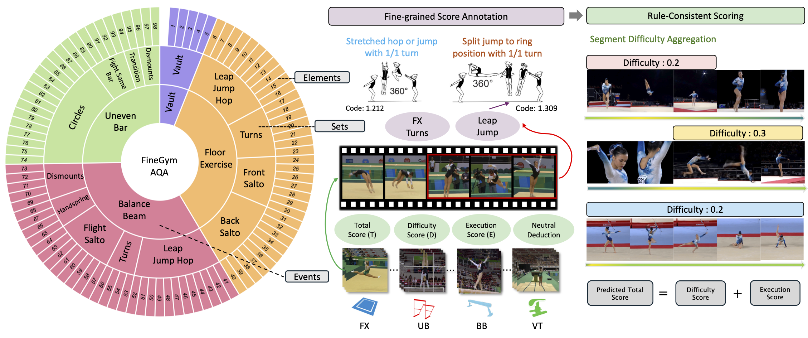

# FineGrade: A Rule-Consistent Scoring Framework for Fine-Grained Action Quality Assessment

This repository hosts the release for FineGym-AQA, a fine-grained action quality assessment benchmark built on top of [FineGym](https://www.baidu.com).



## Annotation Format

Each source video is indexed by a video ID. Event clips are stored under keys such as `E_000133_000140`.

A typical event entry may contain:

- `event`: apparatus ID
  - `1`: VT
  - `2`: FX
  - `3`: BB
  - `4`: UB
- `timestamps`: clip-level timestamps in the source video
- `segments`: fine-grained element/Sub-action segments
- `score`: routine-level scores (`diff`, `execution`, `nd`, `total`)
- `name` / `number`: athlete metadata when available

### Example

```json
{
  "0jqn1vxdhls": {
    "E_000133_000140": {
      "event": 1,
      "timestamps": [[133.56, 140.68]],
      "name": "Jordyn Wieber",
      "number": "8",
      "score": {
        "diff": 6.5,
        "execution": 9.6,
        "nd": 0.0,
        "total": 16.1
      },
      "segments": {
        "A_0000_0007": {
          "stages": 3,
          "timestamps": [[0.04, 3.49], [3.49, 4.70], [4.70, 7.11]],
          "code": "6.50"
        }
      }
    }
  }
}
```

For longer routines (especially **FX / BB / UB**), `segments` may contain multiple element instances. 


